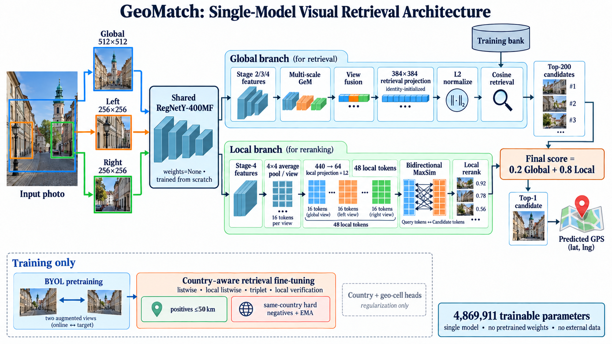
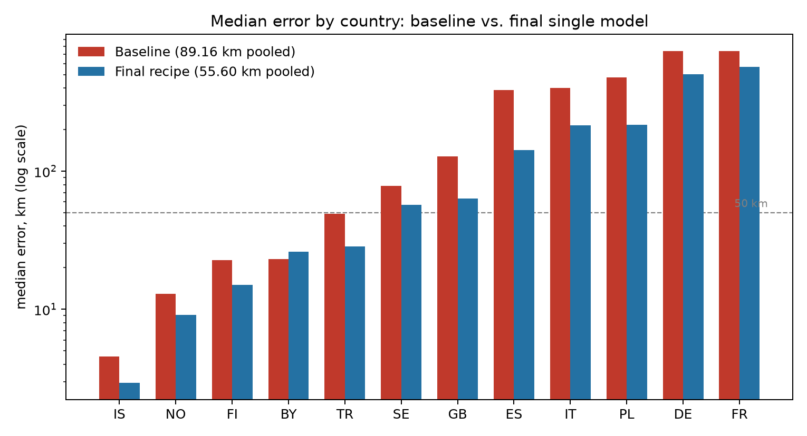
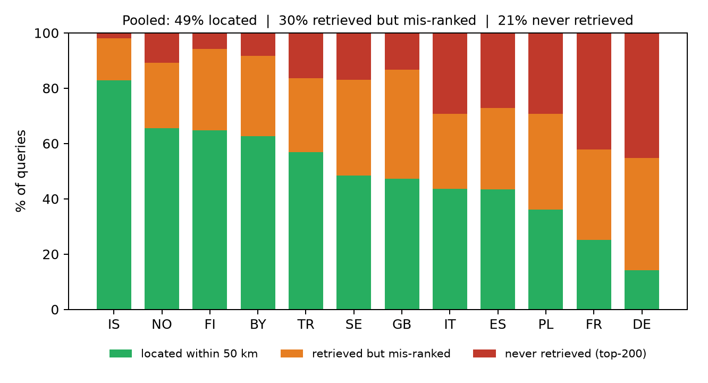

# GeoMatch — photo geolocation by visual retrieval

Single-model image geolocation for a 12-country European dataset (BY, DE, ES,
FI, FR, GB, IS, IT, NO, PL, SE, TR). Given a photo, the model predicts a
latitude/longitude by matching it against a bank of training images and reading
the coordinate of the best match.

## Model

`GeoCPRegNetRetrieval` (`src/retrieval_model.py`):

- A single RegNetY-400MF trunk trained **from scratch** (`weights=None`), shared
  across three views of each image: the full frame at 512 px plus aligned
  left/right crops at 256 px.
- Multi-scale GeM pooling over stages 2–4 into a 384-D global descriptor, plus
  48 local tokens (3 views x a 4x4 grid, 64-D each) for a late-interaction
  (MaxSim) rerank.
- **4,869,911 trainable parameters**.

Decoding: cosine top-200 shortlist on the global descriptor, rerank by
`0.2 * global + 0.8 * local`, take the top-1 candidate's coordinate.



## Training

Two stages, run per fold (train on 4 folds, evaluate on the held-out
one, fixed epoch count, no checkpoint selection):

1. **Self-supervised backbone pretraining** (`src/ssl_pretrain_backbone.py`) —
   BYOL (negative-free, momentum target + predictor), labels unused.
2. **Country-aware retrieval fine-tuning**
   (`src/country_aware_retrieval_finetune.py`, config `configs/final_recipe.json`)
   — spatial listwise + local listwise + triplet + local-verification losses,
   geographic positives within 50 km (see note below), same-country hard negatives (60–700 km) re-mined each
   epoch, anchor oversampling for the weakest countries (DE, FR, PL, IT, ES, SE,
   GB), EMA teacher, 40 epochs.

Positive sampling detail: positives are the 8 most descriptor-similar of the
64 geographically nearest that lie within 50 km. For the 10.7% of anchors with
fewer than 8 such neighbours the sampler falls back to the 8 most
descriptor-similar of those same 64 **without the 50 km filter**, so the 50 km
bound holds for ~89% of anchors, not all.

Training time (single RTX 4000 Ada, 20 GB): BYOL backbone ≈ 2 h 40 m per fold;
retrieval finetune ≈ 70 min (40 epochs). The submitted all-data model reuses an
existing backbone, so end to end it is ≈ 70 min plus ≈ 5 min to write
`predictions.csv`.

## Results

Pooled 5-fold out-of-fold error. The shipped-recipe row is the mean ± sample
s.d. of three independently seeded runs (medians 55.60 / 57.12 / 57.71; **best
observed 55.60**). The submitted model retrains the same recipe on all 11,758
images using the config's default seed, which was **not** among the three
evaluated — no seed was selected on evaluation results.

| pooled 5-fold OOF | runs | median | mean | <200 km | <750 km |
|---|---:|---:|---:|---:|---:|
| Geo-cell classification (dropped) | 1 | 75.2 km | — | — | — |
| From-scratch retrieval baseline | 1 | 89.2 km | 618 km | 55.9% | 69.4% |
| + BYOL + country-aware, 22 ep | 1 | 58.0 km | 490 km | 60.7% | 76.2% |
| **+ 40 epochs (shipped recipe)** | 3 | **56.8 ± 1.1 km** | 469 km | 61.4% | 77.1% |
| *(non-compliant)* 3-model ensemble | 1 | 52.0 km | — | — | — |
| *(non-compliant)* 6-model ensemble | 1 | 49.7 km | — | — | — |

The geo-cell predecessor was *better* than the retrieval baseline (75.2 vs
89.2 km) — retrieval started worse and overtook it only after self-supervised
pretraining. The ordering is left non-monotonic rather than hidden.



### Where the error comes from

Splitting every query into *located* (≤50 km), *retrieved but mis-ranked*, and
*never retrieved into the top-200* separates the two failure modes. The last
column is the share of queries with **any** bank photo within 1 km — a measure
of the bank's local geographic coverage. Ranking countries by it reproduces the
performance ordering almost exactly (Spearman −0.89 against median error); that
is an association, not a demonstrated cause, and photos within 1 km need not be
views of the same scene. Single seed (the 55.60 km run).

| | located | mis-ranked | never retrieved | bank <1 km | median |
|---|---:|---:|---:|---:|---:|
| **Pooled** | 49.1% | 30.3% | 20.7% | 30.1% | 55.6 km |
| Iceland | 82.9% | 15.2% | 1.9% | 57.6% | 2.9 km |
| Norway | 65.6% | 23.6% | 10.8% | 49.5% | 9.1 km |
| Finland | 64.8% | 29.3% | 5.9% | 30.1% | 15.0 km |
| Belarus | 62.6% | 29.1% | 8.3% | 40.2% | 26.1 km |
| Turkey | 56.9% | 26.8% | 16.3% | 33.1% | 28.4 km |
| Sweden | 48.5% | 34.6% | 17.0% | 22.8% | 57.2 km |
| United Kingdom | 47.2% | 39.5% | 13.3% | 28.9% | 63.2 km |
| Italy | 43.6% | 27.2% | 29.2% | 28.3% | 214.6 km |
| Spain | 43.4% | 29.5% | 27.1% | 31.8% | 142.2 km |
| Poland | 36.1% | 34.6% | 29.3% | 16.8% | 217.2 km |
| **France** | 25.2% | 32.7% | **42.1%** | 14.5% | **570.4 km** |
| **Germany** | 14.2% | 40.6% | **45.2%** | 9.1% | **504.8 km** |

Ranking is the larger loss pooled, but for Germany and France nearly half of
queries never retrieve a nearby image at all — both stages fail there, so no
reranker could have closed it. Coverage does **not** explain the failure
either: the nearest German bank photo is a median 8.8 km away against a 505 km
German median, so the shortfall is not that no usable neighbour exists.



## Layout

```
configs/                  final_recipe.json (training recipe), data.json (view + augmentation spec)
src/                      model, data pipeline, objectives, and the training/inference entry points
splits/                   folds_seed42.csv (the 5-fold split we generated, seed 42)
artifacts/fold_assignments/  per-fold train/validation rows and geo-cell labels
artifacts/normalization/  per-fold channel mean/std, fit on that fold's training images only
artifacts/teacher_cache/  frozen distillation targets the objective needs (see below)
artifacts/ssl_backbone/   the five BYOL backbones the fine-tune starts from
artifacts/oof_evidence/   the out-of-fold predictions behind every reported number
setup.sh                  rebuilds the environment and verifies the artifacts
model/model_final.pt      the submitted model (EMA weights, 4,869,911 parameters)
predictions.csv           holdout predictions from that checkpoint
images/                   figure-generation script and the figures used in the write-up
EXPERIMENT_LOG.md         narrative record of what was tried and why
EXPERIMENTS_TABLE.md      the same history as a compact experiment/result/issue table
```

### The teacher cache

The retrieval objective distils toward a set of frozen descriptors. They set
the soft listwise targets for the global and local listwise terms, and they
order the geographic-positive pool — so they shape training regardless of
`descriptor_preservation_weight`, which the shipped recipe sets to `0.0`
(that switches off only the extra cosine preservation term). Those descriptors
come from two earlier encoders that are *not* part of the submitted model:

| what | source | used for |
|---|---|---|
| fused 384-D descriptors | joint geo-cell classification model, epoch 9 of each fold | listwise distillation targets; ordering the geographic-positive pool |
| epoch-0 hard-negative ranking | locked retrieval baseline, epoch 6 of each fold | the first epoch's hard negatives only — every later epoch re-mines from the run's own EMA |

`artifacts/teacher_cache/fold_*.npz` (~24 MB each) holds exactly what training
reads, so a clean checkout trains without any external artifact. Each file has
a `fold_*.json` manifest recording its SHA-256, the source checkpoint paths and
their SHA-256s, and the sampling bands the cached epoch-0 rows were resolved
under; the loader refuses a cache whose hash or sampling bands disagree.

```bash
# check the committed cache (no GPU, no other artifacts needed)
python src/build_teacher_cache.py --verify

# rebuild it, if you have the two source caches
python src/build_teacher_cache.py --folds 0 1 2 3 4 \
    --descriptor-source <dir> --mining-source <dir>
```

The two source encoders' checkpoints are training outputs of abandoned
architectures and are not in this repository, so the committed cache is where
reproducibility bottoms out. Its descriptors are byte-identical to the ones the
reported runs used, and the cached epoch-0 hard-negative rows reproduce the
recorded epoch-1 mining report of the 55.60 km run exactly.

## Setup

```bash
./setup.sh                       # or: ./setup.sh --data-root /path/to/geo_dataset
source venv/bin/activate
```

`setup.sh` creates the virtualenv, installs the pinned dependencies, locates the
dataset, and verifies the teacher cache, the BYOL backbones and the submitted
checkpoint's parameter count. It prints the commands below with your paths
filled in.

Trained and evaluated on Python 3.12.3, CUDA 13.0 (driver 580.159.03), one
NVIDIA RTX 4000 Ada Generation (20 GB, compute capability 8.9). Training and
inference both require a bfloat16-capable CUDA GPU; `requirements.txt` pins the
exact package versions used.

Image data is expected at `/var/tmp/luli38se-geomatch/data/geo_dataset`, with
`train/` and `holdout_public/` beneath it. Override with `--images <path>` on
either training script, or `--data-root <path>` on `predict_holdout.py`.

## Run

### Reproduce the submitted predictions

Everything needed is in this repository:

```bash
python src/predict_holdout.py \
    --model model/model_final.pt \
    --data-root /path/to/geo_dataset \
    --output predictions_recheck.csv
```

This encodes all 11,758 training images as the bank plus the 2,400 holdout
images, runs the top-200 shortlist and late-interaction rerank, and writes
`filename,pred_lat,pred_lng`. It takes about five minutes and should match the
committed `predictions.csv` row for row.

### Retrain the submitted model (all 11,758 images, no held-out fold)

```bash
python src/full_data_finetune.py --resume
```

The BYOL backbones are committed under `artifacts/ssl_backbone/`, so this is a
single ~70-minute step; the submitted model started from `fold_2.pt`
(SHA-256 `1594c81a…`, the value its checkpoint records). To rebuild a backbone
from scratch instead — 160 epochs, labels unused, ~2 h 40 m per fold:

```bash
python src/ssl_pretrain_backbone.py --fold 2 --output artifacts/ssl_backbone
```

### Cross-validation (produces the reported 5-fold OOF numbers)

```bash
for f in 0 1 2 3 4; do
  python src/ssl_pretrain_backbone.py --fold $f
done

python src/country_aware_retrieval_finetune.py \
    --config configs/final_recipe.json --folds 0 1 2 3 4 --seed-base 220517
```

The reported single-model numbers are three runs of this exact command that
differ only in `--seed-base`:

| `--seed-base` | pooled OOF median | mean | within 50 km |
|---|---:|---:|---:|
| 220517 | 55.60 km | 468.6 km | 49.1% |
| 331901 | 57.12 km | 471.1 km | 48.8% |
| 447803 | 57.71 km | 468.2 km | 48.6% |

Each of those runs' per-fold predictions is in `artifacts/oof_evidence/predictions/`,
alongside the baseline and the 22-epoch run, so every number in this README and
the write-up can be recomputed without re-running anything.

which is the 56.8 ± 1.1 km headline. Two other seeds appear in the history:
933071 is the earlier 22-epoch run (57.95 km), and 940111 is
`configs/final_recipe.json`'s own default — the seed the submitted all-data
model used, and one that was never scored on cross-validation.

Each fold's per-epoch checkpoint carries model, EMA **and** AdamW state, so
`--resume` continues the same trajectory rather than restarting the optimiser's
moments. Checkpoints written before that was true are rejected on resume rather
than silently continued.

### Figures

```bash
python images/make_figures.py
```

Everything the figures need is committed under `artifacts/oof_evidence/`: the
pooled baseline predictions, the five per-fold predictions of the 55.60 km run,
the two training curves, and `error_decomposition.csv` — the per-query shortlist
and coverage distances behind the table above, derived from descriptor caches
that are 93 MB per fold and not in this repository (`error_decomposition.json`
records which caches, and their SHA-256s). Only the example panel needs the
dataset itself. `images/geomatch.png` is drawn by hand, not generated.

## Formatting

```bash
pip install black isort
isort src images && black src images
```

Configuration is in `pyproject.toml` (black + isort, 88-column).
