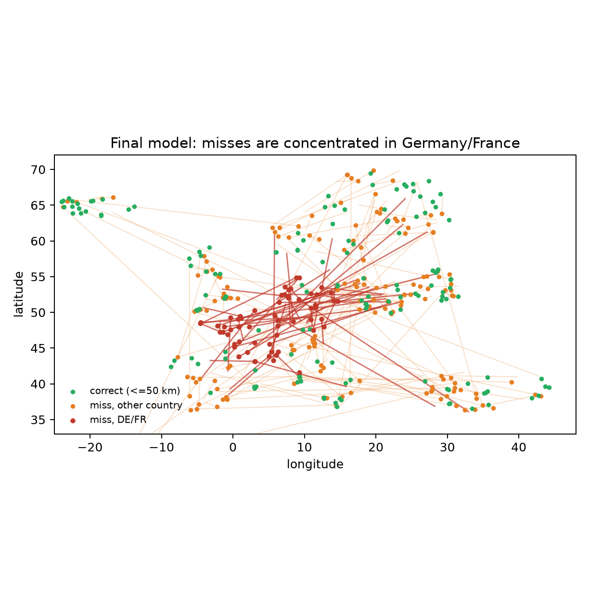

# GeoMatch — photo geolocation by visual retrieval

Single-model image geolocation for a 12-country European dataset (BY, DE, ES,
FI, FR, GB, IS, IT, NO, PL, SE, TR). Given a photo, the model predicts a
latitude/longitude by matching it against a bank of training images and reading
the coordinate of the best match.

## Model

`GeoCPRegNetRetrieval` (`src/retrieval_model.py`):

- A single RegNetY-400MF trunk trained **from scratch** (`weights=None`), shared
  across three views of each image: the full frame at 512 px plus aligned
  left/right crops at 256 px.
- Multi-scale GeM pooling over stages 2–4 into a 384-D global descriptor, plus
  48 local tokens (3 views x a 4x4 grid, 64-D each) for a late-interaction
  (MaxSim) rerank.
- **4,869,911 trainable parameters**.

Decoding: cosine top-200 shortlist on the global descriptor, rerank by
`0.2 * global + 0.8 * local`, take the top-1 candidate's coordinate.


## Training

Two stages, run per fold (train on 4 folds, evaluate on the held-out
one, fixed epoch count, no checkpoint selection):

1. **Self-supervised backbone pretraining** (`src/ssl_pretrain_backbone.py`) —
   BYOL (negative-free, momentum target + predictor), labels unused.
2. **Country-aware retrieval fine-tuning**
   (`src/country_aware_retrieval_finetune.py`, config `configs/final_recipe.json`)
   — spatial listwise + local listwise + triplet + local-verification losses,
   geographic positives within 50 km, same-country hard negatives (60–700 km) re-mined each
   epoch, anchor oversampling for the weakest countries (DE, FR, PL, IT, ES, SE,
   GB), EMA teacher, 40 epochs.

Training time (single RTX 4000 Ada, 20 GB): BYOL backbone ≈ 2 h 40 m per fold;
retrieval finetune ≈ 70 min (40 epochs). The submitted all-data model reuses an
existing backbone, so end to end it is ≈ 70 min plus ≈ 5 min to write
`predictions.csv`.

## Results

Pooled 5-fold out-of-fold median haversine error, over three independently
seeded runs of the shipped recipe: **56.8 ± 1.1 km** (55.60 / 57.12 / 57.71;
best observed 55.60). The submitted model retrains the same recipe on all
11,758 images using the config's default seed, which was not among the three
evaluated — no seed was selected on evaluation results.

Self-supervised pretraining plus the country-aware retrieval finetune cut the
per-country error across the board versus a plain from-scratch retrieval
baseline — except in Germany and France, which stay far behind every other
country:


Splitting every query into *located* (≤50 km), *retrieved but mis-ranked*, and
*never retrieved into the top-200* separates the two failure modes. Pooled, the
split is 49.1% / 30.3% / 20.7% — ranking is the larger single loss, but recall
failure is not negligible. For Germany it is 14.2% / 40.6% / **45.2%**: nearly
half of German queries never retrieve a nearby image at all, so both stages fail
there and no reranker could have fixed it.




## Layout

```
configs/            final_recipe.json (training recipe), data.json (view + augmentation spec)
src/                model, data pipeline, objectives, and the two training entry points
splits/             official_folds_seed42.csv
artifacts/          per-fold normalization stats and geo-cell assignments read by the pipeline
images/             figure-generation script and the figures used in the write-up
EXPERIMENT_LOG.md   narrative record of what was tried and why
EXPERIMENTS_TABLE.md the same history as a compact experiment/result/issue table
```

## Setup

```bash
python -m venv venv
source venv/bin/activate
pip install -r requirements.txt
```

Requires a CUDA GPU with bfloat16 support for training. Image data is expected at
`/var/tmp/luli38se-geomatch/data/geo_dataset/train`; override with `--images
<path>` on either training script.

## Run

### Cross-validation (produces the reported 5-fold OOF numbers)

```bash
# 1. SSL backbone, one per fold
for f in 0 1 2 3 4; do
  python src/ssl_pretrain_backbone.py --fold $f
done

# 2. retrieval fine-tune across all folds
python src/country_aware_retrieval_finetune.py \
    --config configs/final_recipe.json --folds 0 1 2 3 4
```

### Submitted model (all 11,758 images, no held-out fold)

```bash
# retrain the recipe on every labelled image (resume-safe)
python src/full_data_finetune.py --resume

# generate predictions.csv for the public holdout set
python src/predict_holdout.py
```

`full_data_finetune.py` initialises the trunk from one of the BYOL backbones
above and finetunes for 40 epochs on all labelled data; `predict_holdout.py`
runs the top-200 shortlist + late-interaction rerank and writes
`predictions.csv` (`filename,pred_lat,pred_lng`, 2400 rows).

```bash
# regenerate report figures from saved predictions
python images/make_figures.py
```

Note: `make_figures.py` reads cached out-of-fold predictions and descriptor
caches under `/var/tmp/luli38se-geomatch/outputs/`, which are training outputs
and are **not** checked into this repository. The committed figures cannot be
reproduced from a clean clone without first re-running the cross-validation
above. `images/geomatch.png` is drawn by hand, not generated.

## Formatting

```bash
pip install black isort
isort src images && black src images
```

Configuration is in `pyproject.toml` (black + isort, 88-column).
